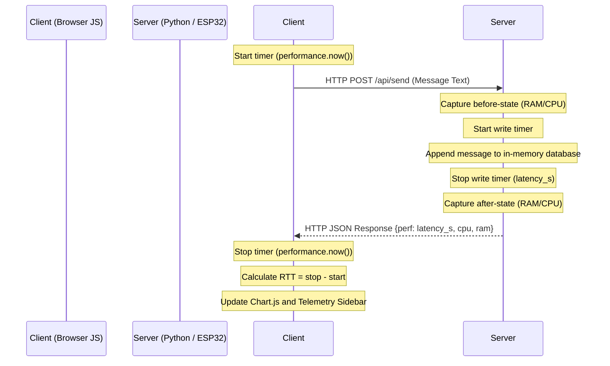

# WiFi Secure Chat Application — Comprehensive Technical & Deployment Guide

This guide serves as a complete developer manual for the **WiFi Secure Chat Application**. It provides step-by-step instructions to configure, run, and deploy the application across three environments: **Laptop (Localhost)**, **Cloud (Render/AWS Docker)**, and **Edge (ESP32 microcontroller)**. It also explains the mechanics of the live telemetry system and key architecture fixes.

---

## 1. Directory & System Architecture

The application is structured to share a single frontend interface across both Python Flask (Laptop/Cloud) and C++ (ESP32) backend implementations.

### Directory Layout
```text
wifi_chat_app/
├── app.py                  # Python Flask Application (Main backend)
├── config.py               # Multi-environment Python Configuration
├── requirements.txt        # Python dependency manifest
├── Dockerfile              # Container building directives (Cloud)
├── .dockerignore           # Cloud container build exclude filters
├── .gitignore              # Git code tracking exclusions
├── static/
│   ├── css/
│   │   └── style.css       # Premium dark-theme glassmorphic stylesheet
│   └── js/
│       └── app.js          # Short-polling telemetry and chat client logic
├── templates/
│   └── index.html          # HTML5 layout structure
└── esp32_chat_app/
    └── esp32_chat_app.ino  # Embedded C++ web server & database for ESP32
```

---

## 2. Technical Specifications & Features

- **No Heavy Dependencies:** The application uses lightweight HTTP short-polling heartbeats (triggered every 900ms), making it fully compatible with low-memory environments like microcontrollers and free cloud instances without overhead from WebSockets.
- **Micro-Sized Database:** Sessions, user states, and messages are tracked entirely in-memory using thread-safe structures in Python (`threading.Lock` and `dict` lists) and static buffer arrays in C++ (avoiding fragmentation on microcontrollers).
- **Access Control:** Secured via a single password (`1234!@#$`). Successful logins issue a UUID session token stored in client-side `localStorage`. All APIs require this token.
- **Orphan Session Sweeper:** Automatically clears inactive users who fail to poll for more than 6 seconds, notifying active chat partners to close their session immediately.
- **Glassmorphic Responsive Design**: Sleek dark-mode interface designed with curated HSL color gradients, hover state animations, and collapsible performance sidebars that adapt seamlessly to mobile screens.

---

## 3. How Performance Metrics are Extracted

The app features a collapsible **📊 Perf** panel showing live telemetry from the backend and network interface. Below is how each metric is extracted and calculated:



### A. RTT Ping (Network Latency)
- **Extracted By**: Client-side JavaScript (`static/js/app.js`).
- **Mechanism**: The client records a timestamp using `performance.now()` immediately before initiating an HTTP poll request to `/api/poll`. When the response is received, a second timestamp is recorded. 
- **Calculation**: 
  $$\text{RTT Ping (ms)} = \text{Timestamp}_{\text{end}} - \text{Timestamp}_{\text{start}}$$

### B. Real Message Processing Latency
Unlike deep learning models (e.g., the old TTS app which timed model inference durations), a chat app's backend logic executes in fractions of a millisecond. We profile the exact execution time required to append a message to our in-memory database within the thread-safe locks:
- **Python Backend**:
  Using Python's high-resolution performance counter `time.perf_counter()`:
  ```python
  start_time = time.perf_counter()
  with state_lock:
      # Append message to in-memory dictionary
  latency_s = time.perf_counter() - start_time
  ```
- **ESP32 Backend**:
  Using the hardware microcontroller microsecond clock `micros()`:
  ```cpp
  unsigned long startMicros = micros();
  // Append message to static memory buffer
  unsigned long endMicros = micros();
  float latencyMs = (float)(endMicros - startMicros) / 1000.0;
  ```

### C. CPU Load
- **Python Backend**: Profiled using `psutil.cpu_percent(interval=None)` which captures logical core utilization without blocking the execution thread.
- **ESP32 Backend**: Because bare-metal microcontrollers run single-threaded loops without standard operating systems, a fixed value of `100%` active state is returned to denote CPU execution, alongside the physical core frequency retrieved using `ESP.getCpuFreqMHz()`.

### D. RAM Allocation and Memory Delta
- **Python Backend**: Queried from virtual memory counters (`psutil.virtual_memory()`). We calculate the RAM delta before/after writing a message:
  $$\text{RAM Delta (MB)} = \frac{\text{Memory Used}_{\text{after}} - \text{Memory Used}_{\text{before}}}{1024^2}$$
- **ESP32 Backend**: Queried from the internal system allocator:
  ```cpp
  uint32_t freeHeap = ESP.getFreeHeap(); // Bytes
  uint32_t totalHeap = ESP.getHeapSize();
  ```

### E. Stress Tester (Load Tester)
The stress tester runs inside the browser and makes concurrent POST requests to the message route `/api/send` to test edge/cloud throughput limits:
- **Throughput (req/s)**:
  $$\text{Throughput} = \frac{\text{Completed Requests}}{\text{Total Elapsed Time (seconds)}}$$
- **Percentiles (P50, P95, P99)**:
  Latencies of successful requests are sorted in ascending order.
  $$\text{P50 (Median)} = \text{Latencies}\left[ \lfloor 0.5 \times N \rfloor \right]$$
  $$\text{P95 Latency} = \text{Latencies}\left[ \lfloor 0.95 \times N \rfloor \right]$$
  $$\text{P99 Latency} = \text{Latencies}\left[ \lfloor 0.99 \times N \rfloor \right]$$

---

## 4. Environment-Specific Deployment Guides

---

### Deployment Strategy 1: Laptop (Localhost)

Set up a baseline environment using a local Python virtual environment.

#### Step 1: Initialize Virtual Environment
Open PowerShell (Windows) or Terminal (macOS/Linux) and navigate to the project directory:
```powershell
cd d:\EdgeAi_resistor_Dl_model\Edge_AI-Computing\wifi_chat_app
python -m venv venv
```

#### Step 2: Activate the Virtual Environment
- **Windows (PowerShell):**
  ```powershell
  .\venv\Scripts\Activate.ps1
  ```
- **macOS/Linux (Terminal):**
  ```bash
  source venv/bin/activate
  ```

#### Step 3: Install Dependencies
```powershell
pip install -r requirements.txt
```

#### Step 4: Launch the Server
```powershell
python app.py
```

> [!WARNING]
> **PowerShell Command Precedence:** 
> In Windows PowerShell, scripts in the current directory cannot be launched by typing their filename (`app.py`) directly. This is a PowerShell security design. Always start the server using `python app.py` or `.\app.py` to prevent a `CommandNotFoundException`.

#### Step 5: Access the Web App
1. Open your web browser and navigate to `http://127.0.0.1:5002`.
2. Enter the local access password: `1234!@#$`.
3. To chat between devices on the same local router network, open your command-line and find your local IP address (e.g., `ipconfig` -> `192.168.1.15`). Other devices can open `http://192.168.1.15:5002`.

---

### Deployment Strategy 2: Cloud Deployment (Render)

Render uses the `Dockerfile` in the root folder to package, compile, and expose the app.

#### Step 1: Create a GitHub Repository
Log in to your GitHub account and create a repository named `wifi-secure-chat`.

#### Step 2: Push Local Code to GitHub
Execute the following commands in your local command terminal to initialize Git and push the source code:
```powershell
# Navigate to the chat directory
cd d:\EdgeAi_resistor_Dl_model\Edge_AI-Computing\wifi_chat_app

# Initialize local git repository
git init

# Track all project files (.gitignore will exclude venv/ automatically)
git add .

# Create the initial commit
git commit -m "Initial commit for WiFi Chat App"

# Rename default branch to main
git branch -M main

# Link to your github repository
git remote add origin https://github.com/snehvardhan275/wifi-secure-chat.git

# Push code to GitHub
git push -u origin main
```

#### Step 3: Deploy on Render
1. Log in to the [Render Dashboard](https://dashboard.render.com).
2. Click **New +** and select **Web Service**.
3. Under *Connect a repository*, link your GitHub account and select your `wifi-secure-chat` repository.
4. Render automatically parses the `Dockerfile`. Set:
   - **Name:** `wifi-secure-chat`
   - **Instance Type:** `Free`
5. Click **Advanced** and add the following **Environment Variables**:
   - `CHAT_ENV` = `CLOUD`
   - `SECRET_KEY` = `your_secure_random_key_string`
6. Click **Create Web Service**. Render will build the container image and assign a public DNS URL (e.g. `https://wifi-secure-chat.onrender.com`).

> [!CRITICAL]
> **Production Gunicorn Configuration (Session Isolation Fix):**
> Gunicorn runs with multiple isolated process workers by default (e.g., `--workers 2`). Because user sessions are tracked in-memory, requests from a single client will load-balance between different processes, resulting in immediate "Session expired or timed out" (401 Unauthorized) errors during polling. 
> To resolve this, Gunicorn must be configured to run with exactly **1 worker** and multiple threads to preserve session state:
> `CMD ["gunicorn", "app:app", "--bind", "0.0.0.0:8080", "--workers", "1", "--threads", "4", "--timeout", "120"]`

---

### Deployment Strategy 3: Edge Deployment (ESP32 Dev Board)

Because the web resources (HTML/CSS/JS) are stored directly inside the ESP32 Flash memory (`PROGMEM`), the application runs standalone on the microcontroller with zero reliance on external SD cards.

#### Step 1: Pre-requisites in Arduino IDE
1. Open **Arduino IDE**.
2. Go to **File > Preferences**.
3. In *Additional Boards Manager URLs*, insert:
   `https://raw.githubusercontent.com/espressif/arduino-esp32/gh-pages/package_esp32_index.json`
4. Go to **Tools > Board > Boards Manager...**, search for `esp32` by Espressif, and click **Install**.
5. Go to **Sketch > Include Library > Manage Libraries...**, search for `ArduinoJson` (by Benoit Blanchon) and click **Install** (supports both v6 and v7).

#### Step 2: Open and Configure Sketch
1. Open `esp32_chat_app/esp32_chat_app.ino` in Arduino IDE.
2. Update lines 19-20 with your home WiFi router SSID and Password:
   ```cpp
   const char* WIFI_SSID = "YOUR_WIFI_SSID";
   const char* WIFI_PASS = "YOUR_WIFI_PASSWORD";
   ```

#### Step 3: Compile and Upload
1. Plug your **ESP32 development board** into your laptop via USB.
2. Select your board under **Tools > Board > ESP32 Arduino** (e.g., `ESP32 Dev Module`).
3. Select your serial COM port under **Tools > Port**.
4. Click the **Upload** arrow icon.

#### Step 4: Running the Server
1. Open the Serial Monitor (**Tools > Serial Monitor**) and set the speed to `115200` baud.
2. Press the **EN/RST** reset button on the ESP32.
3. The board will run in two modes:
   - **Station Mode (Connected to WiFi)**: Displays its assigned network IP address (e.g., `192.168.1.15`). Any device connected to the same WiFi network can navigate to `http://192.168.1.15` to access the chat web application.
   - **Access Point Mode (Fallback)**: If connection to your router fails, the ESP32 launches its own WiFi hotspot. Connect to:
     - **SSID**: `ESP32-Chat-Hub`
     - **Password**: `12345678`
     Open your phone's WiFi settings, connect to `ESP32-Chat-Hub`, and navigate to `http://192.168.4.1` to access the chat application.

> [!IMPORTANT]
> **ESP32 Dynamic Memory Management:**
> To ensure the ESP32 does not run out of memory or truncate response payloads when returning a history of up to 30 processing logs, `DynamicJsonDocument responseDoc(6144)` is allocated on the heap rather than the stack inside the `handleApiPerformance` function.

---

## 5. Console Compatibility Fix (Windows)

On Windows terminal shells, printing emojis or unicode characters to the standard console (CP1252 character set) can result in a crash:
```text
UnicodeEncodeError: 'charmap' codec can't encode character '\U0001f4bb' in position 18
```
To prevent this, the application defines a custom `safe_print()` function at the top of `app.py` to ensure it never crashes during logging:
```python
import sys
import builtins

def safe_print(*args, **kwargs):
    encoding = getattr(sys.stdout, "encoding", None) or "utf-8"
    safe_args = []
    for arg in args:
        if isinstance(arg, str):
            try:
                arg.encode(encoding)
                safe_args.append(arg)
            except UnicodeEncodeError:
                safe_args.append(arg.encode(encoding, errors="replace").decode(encoding))
        else:
            safe_args.append(arg)
    try:
        builtins.print(*safe_args, **kwargs)
    except Exception:
        pass

print = safe_print
```

---

## 6. How to Run a Secure Chat Session

1. **Access**: Navigate to the server IP/URL in your web browser.
2. **Log In**: Enter your **Username** (Max 15 characters) and the access key: `1234!@#$`. Click **Log In**.
3. **Connect**: Online users will be shown under the **Connected Users** list. Click **Connect 🔌** on the card of the user you want to chat with.
4. **Chat**: Both users will be locked into a secure session and their status badges will show **BUSY**. Type a message and hit **Send**. Typing indicators are rendered dynamically when your partner is active.
5. **Perf Check**: Click **📊 Perf** in the top-right corner to open the performance dashboard, view resource loads, see the live latency line chart, and execute stress tests.
6. **Terminate**: To close the session and return to the main dashboard, click **⛔ End Chat** in the top-left corner.
